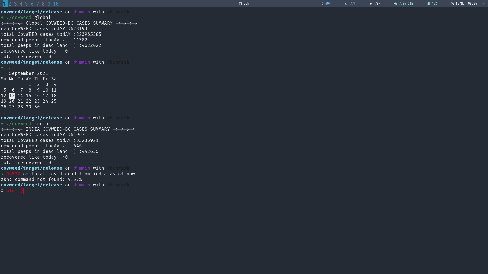

<h1 align="center"> 😷 COVID CLI 😷</h1>


# DESCRIPTION :
- This is CLI program that give various stats about covid either globally or for a country . 

## To use :
### 1. Clone the repo and build in release mode 🛠️

```bash 
cd covweed && cargo build --release
```
### 2. Add to path 🛣️
```bash
cp target/release/covweed  ~/.local/bin/covweed
```
### 3. Run the executable , make sure to have cargo v1.54+ 🦀

* For Global  🌎
```bash  
covweed global  
```
* For Specific country  🇮🇳
```bash
covweed india
```

